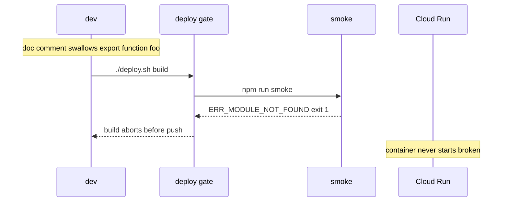

# Build Tooling: TypeScript + ESLint + Styling + Deploy Gate

Use this skill to add a **developer-experience / correctness layer** across every
app package so a broken export fails **CI**, never a running container. It exists
because plain-JS is fragile: an unterminated doc comment can swallow an `export`,
and a test runner that only transforms test files can pass while a module fails to
import. The fix is build-time type safety, linting, a startup import-resolution
guard, and a consistent styling approach — all wired into the same pipeline that
gates deployment.

## Locked decisions
- **Frontend = 100% strict TypeScript** (no `.js`, no `any`), type-checked by
  `vue-tsc --noEmit`; ESLint enforces `no-explicit-any: error`.
- **Node packages type-checked as JavaScript** with `tsc --noEmit` + `checkJs` — a
  module/export-resolution gate, not a rewrite. (Or, if fully migrated, strict TS
  compiled via `tsconfig.build.json`.)
- **Lint** backend + frontend with ESLint flat config.
- **A startup import smoke test** for Node packages (they ship raw JS, no bundler);
  the **frontend uses its bundler build** as the resolve guard.
- **Utility-first styling** (e.g. Tailwind) for the frontend; scoped CSS only where
  utilities can't reach (e.g. runtime-generated HTML).
- **Wire checks into the deploy pipeline** — typecheck → lint → smoke → test →
  build, before any image push.
- **No new runtime deps** — TS/ESLint/styling are dev/build-time only.

## The regression it prevents


## The steps
1. **Type-checking** — Node packages: `tsconfig.json` with `checkJs`, `NodeNext`,
   `noEmit`; `npm run typecheck` (`tsc --noEmit`). Frontend: strict `.ts` +
   `vue-tsc --noEmit` + a `types/` folder (one file per type-set, no barrel).
2. **ESLint** — `eslint.config.js` per package (`@eslint/js` + node/browser
   globals; frontend adds `@typescript-eslint` + `vue-eslint-parser`, enforces
   `no-explicit-any`). Test-file carve-out for vitest globals.
3. **Startup/import smoke test** — `scripts/smoke.js` in the Node packages imports
   every entrypoint into a real ESM graph; the frontend uses its bundler build as
   the resolve guard (no separate smoke script).
4. **Styling** — utility-first CSS (e.g. `@import 'tailwindcss'` + theme tokens +
   base reset); all component styling as utilities in the templates; a small
   scoped style for runtime-generated HTML.
5. **Wire checks into deploy** — the deploy wrapper's `run_checks` runs
   typecheck → lint → smoke → test → build before any image push.

## Test coverage (happy + non-happy)
The gate is **not** a unit-test suite — it is a set of build-time checks, each with
a happy and a non-happy path:
- **typecheck** — happy: passes on current code. Non-happy: a dangling
  export/import is a reported error (proven by removing an `export`).
- **lint** — happy: zero errors. Non-happy: an unused/undefined name, or (frontend)
  an explicit `any`, fails the run.
- **smoke** — happy: all Node entrypoints import, exit 0. Non-happy: a missing
  export exits 1. The frontend has no smoke script — its bundler build is the
  resolve-time guard.
- **build** — happy: emits styled CSS + the UI renders. Non-happy: a mistyped
  directive or a missing export fails the build.

## Non-obvious notes / gotchas
- **`tsc` on Node packages is a *module/export* gate, not a full strict-type
  gate.** The Node codebase uses factory-via-DI (factories return plain objects,
  callbacks untyped). Full `strict:true` + `checkJs` surfaces many "implicitly any"
  diagnostics that are **not** the bug class this gate targets. Keep `checkJs` +
  `NodeNext` (so unresolved imports/exports are compile errors) but leave
  `noImplicitAny` off. **This is deliberately different from the frontend**, which
  is 100% strict TS.
- **Frontend is 100% strict TypeScript; Node is type-checked JS.** All frontend
  source + tests are `.ts`; Node packages stay `.js` but pass through `tsc
  --noEmit` + `checkJs` as a type-checking layer.
- **Pin the TypeScript version.** Newer TS lines can report implicit-`any`
  regardless of `noImplicitAny`, which would make the gate unusable on plain-JS
  Node code. Pin to a version that restores the intended semantics.
- **Smoke test is the Node-package guard; the bundler build is the frontend's.**
  Node packages ship raw JS (no bundler), so `tsc` doesn't build them — the smoke
  test (which imports every entrypoint into a real ESM graph) is the only
  resolve-time guard. The frontend has a bundler, so its build resolves the whole
  entry graph and fails on a broken import.
- **ESLint test-file carve-out.** Test files use vitest globals and intentionally
  import helpers; turn `no-unused-vars`/`no-undef` off for tests so lint stays
  green.
- **`no-useless-assignment` is off.** It false-positives on the "declare a default,
  then overwrite in a try/catch" pattern (the reassigned value IS used later).
- **Styling is utility-first; the stylesheet is a thin shell.** All layout &
  component styling lives as utility classes in the templates; the stylesheet only
  imports the CSS tool, defines theme tokens, and resets the base. A small scoped
  style covers runtime-generated HTML (e.g. markdown output) that utilities can't
  reach.
- **`.gitignore` negation.** A broad `*.json` rule (for credentials) can also
  ignore `package.json`/`package-lock.json`/`tsconfig.json`. Add negations so the
  tooling configs and scripts are committed.

## Verification
```bash
# Per package — Node packages run the smoke script; the frontend relies on its build:
cd api       && npm run typecheck && npm run lint && npm run smoke && npm test
cd ingest    && npm run typecheck && npm run lint && npm run smoke && npm test
cd frontend  && npm run typecheck && npm run lint && npm test && npm run build

# The deploy gate — runs all of the above before any image push:
bash -n deploy.sh        # syntax check
./deploy.sh build        # runs run_checks for all packages, then builds images
```
> **Regression proof (the point of this skill).** Removing an `export` from a Node
> package makes `npm run smoke` exit 1 with `ERR_MODULE_NOT_FOUND`; removing an
> `export` from the frontend makes its build fail. In every case the build aborts
> **before** any image is pushed or a container starts.