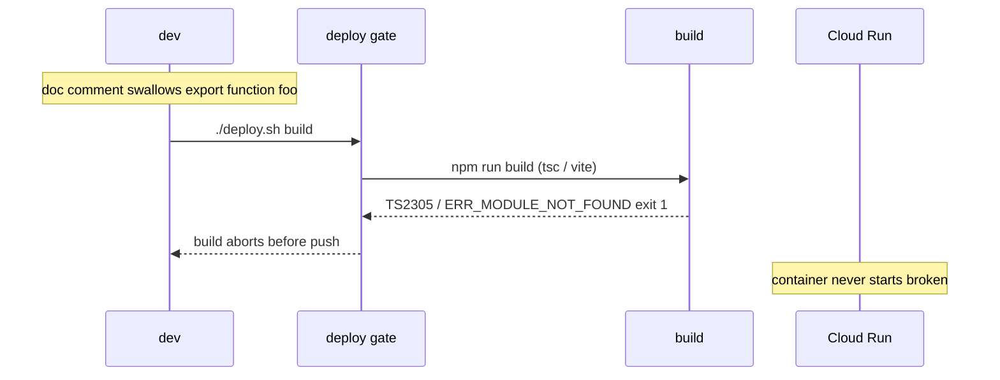

# Build Tooling: TypeScript + ESLint + Prettier + Knip + Deploy Gate

Use this skill to add a **developer-experience / correctness layer** across every
app package so a broken export fails **CI**, never a running container. It exists
because plain-JS is fragile: an unterminated doc comment can swallow an `export`,
and a test runner that only transforms test files can pass while a module fails to
import. The fix is build-time type safety, linting, a dead-code gate, formatting,
and a consistent styling approach — all wired into the same pipeline that gates
deployment.

## Locked decisions
- **All packages = 100% strict TypeScript** (no `.js`, no `any`), type-checked by
  `tsc --noEmit` (Node) / `vue-tsc --noEmit` (frontend); ESLint enforces
  `no-explicit-any: error`.
- **Lint** backend + frontend with ESLint flat config.
- **Formatting** via Prettier, wired in with `eslint-config-prettier` (formatting
  is Prettier's job, lint is ESLint's — no rule duplication).
- **Dead-code gate** via `knip` (unused exports/files/deps that `tsc`/ESLint
  can't see). See the `dead-code-knip` skill for settings.
- **The compile step IS the resolve guard** — `tsc -p tsconfig.build.json` /
  `vite build` fails on a dangling import/export. No separate smoke script.
- **Utility-first styling** (e.g. Tailwind) for the frontend; scoped CSS only where
  utilities can't reach (e.g. runtime-generated HTML).
- **Wire checks into the deploy pipeline** — typecheck → lint → knip → test →
  build, before any image push.
- **No new runtime deps** — TS/ESLint/Prettier/knip are dev/build-time only.

## The regression it prevents


## The steps
1. **Type-checking** — all packages strict TS: `tsconfig.json` with `strict:true`,
   `noImplicitAny`, `verbatimModuleSyntax`, `noEmit`; `npm run typecheck`
   (`tsc --noEmit` / `vue-tsc --noEmit`). Frontend keeps a `types/` folder (one
   file per type-set, no barrel).
2. **ESLint** — `eslint.config.js` per package (`@eslint/js` + node/browser
   globals; frontend adds `@typescript-eslint` + `vue-eslint-parser`, enforces
   `no-explicit-any`). Test-file carve-out for vitest globals.
3. **Prettier** — `.prettierrc.json` per package + `eslint-config-prettier` as the
   LAST config in the flat array (turns off conflicting rules). Scripts:
   `format` (`prettier --write`), `format:check` (`prettier --check`).
4. **Dead-code gate** — `knip` (`npm run knip`, config in `knip.json`). Runs in
   the check chain (full source + tests), NOT inside `npm run build` (the Docker
   build has no tests, so knip would misreport dev-only deps/test-only exports).
5. **Styling** — utility-first CSS (e.g. `@import 'tailwindcss'` + theme tokens +
   base reset); all component styling as utilities in the templates; a small
   scoped style for runtime-generated HTML.
6. **Wire checks into deploy** — the deploy wrapper's `run_checks` runs
   typecheck → lint → knip → test → build before any image push. Fast local
   loops without the Docker build: `./deploy.sh check` (verify only) and
   `./deploy.sh fix` (lint:fix + prettier, then verify).

## Test coverage (happy + non-happy)
The gate is **not** a unit-test suite — it is a set of build-time checks, each with
a happy and a non-happy path:
- **typecheck** — happy: passes on current code. Non-happy: a dangling
  export/import is a reported error (proven by removing an `export`).
- **lint** — happy: zero errors. Non-happy: an unused/undefined name, or (frontend)
  an explicit `any`, fails the run.
- **knip** — happy: no unused exports/files/deps. Non-happy: a dead export fails
  the run. See the `dead-code-knip` skill for settings.
- **build** — happy: emits styled CSS + the UI renders. Non-happy: a mistyped
  directive or a missing export fails the build.

## Non-obvious notes / gotchas
- **The compile step is the module/export resolve guard.** `tsc -p
  tsconfig.build.json` (Node) and `vite build` (frontend) resolve the whole
  entry graph and fail on a broken import/export before any image push. No
  standalone smoke script is needed for strict-TS packages.
- **`knip` runs in the check chain, not inside `npm run build`.** The Docker
  build only copies `lib`/`src` (no tests), so knip would flag dev-only deps and
  test-only exports as unused there. Run it where the full source + tests exist.
- **`eslint-config-prettier` must be the LAST config** in the flat array so it
  overrides any ESLint rules that conflict with Prettier. Formatting is
  Prettier's job; ESLint handles correctness/lint rules.
- **ESLint test-file carve-out.** Test files use vitest globals and intentionally
  import helpers; turn `no-unused-vars`/`no-undef` off for tests so lint stays
  green.
- **`no-useless-assignment` is off.** It false-positives on the "declare a default,
  then overwrite in a try/catch" pattern (the reassigned value IS used later).
- **Styling is utility-first; the stylesheet is a thin shell.** All layout &
  component styling lives as utility classes in the templates; the stylesheet only
  imports the CSS tool, defines theme tokens, and resets the base. A small scoped
  style covers runtime-generated HTML (e.g. markdown output) that utilities can't
  reach.
- **`.gitignore` negation.** A broad `*.json` rule (for credentials) can also
  ignore `package.json`/`package-lock.json`/`tsconfig.json`. Add negations so the
  tooling configs and scripts are committed.

## Verification
```bash
# Fast local loop — fix + verify all packages (no Docker build):
./deploy.sh fix          # lint:fix + prettier, then typecheck/lint/knip/test
./deploy.sh check        # verify only (typecheck/lint/knip/test)

# Per package (all strict TS — build IS the resolve guard):
cd api       && npm run typecheck && npm run lint && npm run knip && npm test && npm run build
cd ingest    && npm run typecheck && npm run lint && npm run knip && npm test && npm run build
cd frontend  && npm run typecheck && npm run lint && npm run knip && npm test && npm run build

# The deploy gate — runs all of the above before any image push:
bash -n deploy.sh        # syntax check
./deploy.sh build        # runs run_checks for all packages, then builds images
```
> **Regression proof (the point of this skill).** Removing an `export` from a Node
> package makes `npm run build` (`tsc -p tsconfig.build.json`) exit 1 with
> `TS2305`/`ERR_MODULE_NOT_FOUND`; removing an `export` from the frontend makes its
> build fail. In every case the build aborts **before** any image is pushed or a
> container starts.