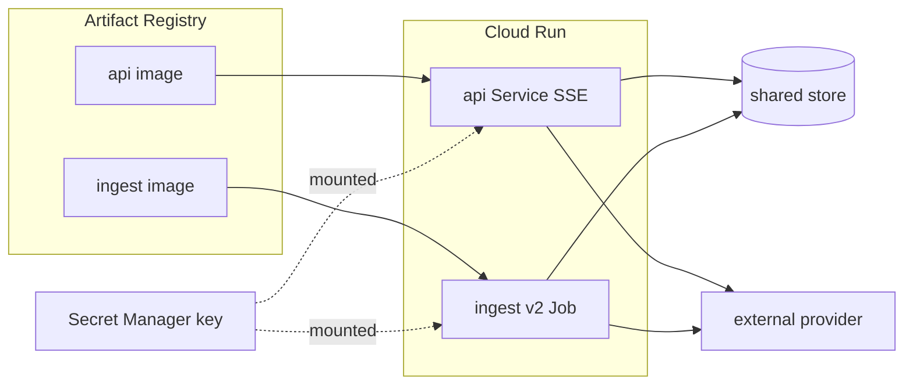

# Cloud Run Deployment & Release

Use this skill to turn injectable seams into **runnable containers** and release
them: build multi-stage images, push to Artifact Registry pinned to a release tag,
and let Terraform roll the Cloud Run Service/Job. It captures the release-tag
no-op trap, the health-endpoint gotcha, and the deploy-gate ordering that prevent
silent no-op deploys and broken containers.

## Locked decisions
- **Terraform is the sole deployment controller.** `deploy.sh push` only fills
  Artifact Registry; a new tag must still be `apply`d via Terraform to reach Cloud
  Run. Never `gcloud run deploy`.
- **Releases are never a static `:latest`.** Every push pins a **git-short-SHA**
  tag committed to `infra/terraform.tfvars`; the HCL image ref includes the tag so
  `apply` genuinely rolls the Service/Job.
- **Secrets via Secret Manager**, mounted as env vars — never baked into an image.
- **Health endpoints** use non-reserved names (`/livez`, `/readyz`), not
  `/healthz` (reserved by the platform edge).
- **Region must agree** across the deploy wrapper, `variables.tf`, and the registry
  prefix.

## Build & push (the release step)
```bash
./deploy.sh build        # build images (local, cross-platform via buildx)
./deploy.sh push         # build + push, pinned to a git-short-SHA tag, written to infra/terraform.tfvars
./deploy.sh plan         # dry-run the rollout
./deploy.sh apply        # interactive — NEVER run by an agent
```
Every push writes a unique tag (git short SHA) to the committed
`infra/terraform.tfvars`:
```
<region>-docker.pkg.dev/<project>/<repo>/<service>:<git-sha>
```
Because the HCL image ref includes `var.image_tag`, a fresh tag changes the HCL,
so `apply` genuinely redeploys — no silent `:latest` no-op.

## The rollout workflow (avoid the no-op trap)
The tag is **the current git short SHA of HEAD**, *not* your working tree. It only
advances when HEAD is a new commit. If you edited code/corpus but haven't
committed, the pushed tag duplicates the already-applied tag, the image-ref string
is identical, and `plan` correctly reports **nothing to change** — no roll happens.

```bash
# 1) Commit the change so the SHA bumps
git add -A && git commit -m "your change"
# 2) Build + push the new tag + dry-run the rollout
./deploy.sh plan                  # expect "N to change" (Service + Job)
# 3) Apply when the plan looks right (run yourself; the agent never applies)
./tf.sh apply
```

## Data-flow (post-deploy)


## Health endpoints (kubelet-style)
The platform's global front-end **reserves `/healthz`** as an internal health-probe
path, so a public request to `/healthz` is short-circuited at the edge and never
reaches the container. Use the modern, non-reserved names:
- `GET /livez` → **200** while the process is up (pure liveness, no deps).
- `GET /readyz` → **200** when the backing store is reachable (readiness probe via
  a bounded call), **503** when down or the probe times out.
- `GET /health` → alias for readiness; `GET /` → alias for liveness.

## Non-obvious notes / gotchas
- **Images must exist before apply.** Cloud Run validates the image reference; a
  dangling tag fails apply. Build + push **first**, then apply.
- **v2 Job, v1 Service.** The installed provider has no GA v1 Job; use
  `google_cloud_run_v2_job`. The Service stays v1 (session affinity is an
  annotation there). Secret ref syntax differs per resource.
- **Region consistency is a hard requirement.** The registry prefix is built from
  `var.region`; if the wrapper and `variables.tf` disagree, the image reference
  won't resolve.
- **A changed image needs a NEW tag, not an overwrite.** Re-pushing the *same* tag
  with new content leaves the applied revision on the old digest and makes `apply`
  a silent no-op. Commit first so the git-short-SHA tag bumps.
- **The deploy role must be codified in Terraform.** The applying SA needs
  `roles/run.admin` to set the IAM policy on the Cloud Run resources it creates;
  `roles/owner` alone can leave `run.services.setIamPolicy` denied. Declare it in
  Terraform so `destroy` + a fresh `apply` rebuilds it with no manual `gcloud`
  step. The Service and Job `depends_on` it so `destroy` removes the role last.
- **A re-run of a seed Job is a no-op unless the manifest version differs.** Two
  independent ways a job can look seeded while containing nothing: (1) a stale
  image with no corpus baked in → writes a `chunkCount: 0` manifest; (2) the same
  manifest version from a prior broken run. Rule of thumb: **content change** →
  bump the manifest version; **code/image change** → new git tag. Often both are
  the same commit.
- **`.dockerignore` must NOT exclude the corpus `*.md`** if the image bakes it.
- **Vulnerability scan noise** from the base image is build-time noise, not a
  block.

## Verification
- `terraform validate` passes.
- `./tf.sh plan` after a release shows `N to change` (Service + Job roll to the new
  image tag).
- `npm test` per package passes.
- `deploy.sh build` builds all images; `docker push` puts them in the registry.
- Health: `GET /livez` → 200, `GET /readyz` → 200 locally and once applied.
- Image tags are committed in `infra/terraform.tfvars` and visible in git.