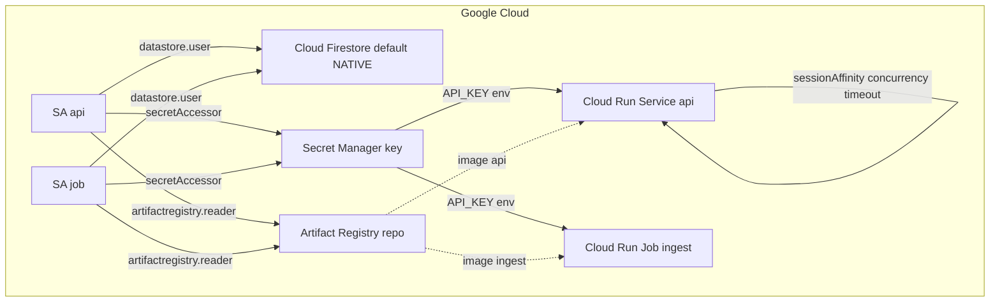

# GCP Serverless Infrastructure with Terraform

Use this skill to own **all** Google Cloud resources for a serverless app via
Terraform. It captures the provider-version gotchas, resource-shape rules, and
IAM wiring that are easy to get wrong and expensive to rediscover. It is written
generically so it applies to any GCP + Cloud Run + Firestore project.

## Locked decisions
- **Terraform is the SOLE deployment controller.** Never `gcloud run deploy`,
  never hand-edit IAM. Every GCP resource lives in `infra/`; the app packages own
  none. `gcloud` is only for reading state / running a Job / setting a secret.
- **Cloud Firestore `(default)` native DB is BOTH the vector store and the
  session/event/message state store.** No Cloud SQL, no VPC connector, no
  BigQuery, no network resources.
- **Secrets (API keys) live in Secret Manager**, mounted into containers as env
  vars — never baked into an image, never committed.
- **Releases are never a static `:latest`.** Every release pins a git-short-SHA
  tag committed to `infra/terraform.tfvars`; the HCL image ref includes the tag
  so `apply` genuinely rolls the Service/Job.
- **Region must agree everywhere** — `variables.tf`, the deploy wrapper, and the
  Artifact Registry prefix are all built from the same region value.

## Provider / version gotchas (highest-frequency failures)
- **Cloud Run Job must use the v2 API** (`google_cloud_run_v2_job`). The v1
  `google_cloud_run_job` does not exist in the installed provider (v6.x) and
  fails `validate`. The **Service** stays v1 (`google_cloud_run_service`) because
  session affinity is a v1 template *annotation*.
- **v2 Job nesting:** the inner `template.template` has **no** `spec` block —
  `timeout`, `service_account`, `containers` sit directly inside it.
  `task_count` / `parallelism` live on the **outer** `template`.
- **v1 Service session affinity** is a template annotation
  (`run.googleapis.com/sessionAffinity`), not a `session_affinity {}` block.
- **`deletion_protection = false`** on the Job is required to allow
  `terraform destroy`.
- **Secret ref syntax differs per resource:** v1 Service uses
  `secret_key_ref { key = "latest" }`; v2 Job uses
  `secret_key_ref { secret, version }`. Mixing them fails `terraform validate`.
- **Images must exist before apply.** Cloud Run validates the image reference; a
  dangling tag fails apply. Build + push **first**, then apply.

## Resource map (the shape to reproduce)


## File layout
| File | Contents |
| --- | --- |
| `versions.tf` | `required_version`; `google` + `google-beta` providers; `backend "local"` (or a state bucket) |
| `main.tf` | Providers; service accounts; IAM grants |
| `variables.tf` | `project_id`, `region`, sensitive secrets (with non-empty validation), registry repo, `image_tag` |
| `locals.tf` | image registry prefix built from `region` + `project_id` |
| `cloud_run.tf` | Service (SSE knobs + affinity) + v2 Job (one-time, ≤24h) + IAM |
| `firestore.tf` | native DB, deny-by-default rules, TTL field, **vector index** |
| `registry.tf` | Artifact Registry repo + reader IAM for both SAs |
| `secrets.tf` | Secret + secret version + secretAccessor for both SAs |

## Cloud Run knobs for a streaming (SSE) backend
- `container_concurrency` ≥ 100 (high concurrency).
- `timeout_seconds` ≥ 300 (long-lived streaming requests).
- session-affinity annotation so a reconnect tends to land on the same instance
  (though state must still be shared — see the stateless-state skill).
- A public `allUsers` invoker IAM for a demo, or a restricted invoker for prod.

## Firestore vector index (the "RAG returns nothing" fix)
`findNearest` **throws** `FAILED_PRECONDITION: Missing vector index configuration`
until a vector index exists on the `chunks` collection's `embedding` field. Add a
`google_firestore_index`:
- `fields { field_path = "__name__"; order = "ASCENDING" }`
- `fields { field_path = "embedding"; vector_config { dimension = <dims>; flat {} } }`

`dimension` must match the embedding model (e.g. 1536). Vector index creation is
**async** and can take ~2–3 min (`STILL CREATING`); `apply` blocks until `READY`.

## IAM / deploy-role gotcha
The applying service account must be able to set the IAM policy on the Cloud Run
resources it creates; `roles/owner` alone can leave
`run.services.setIamPolicy` denied. Codify the deploy role **in Terraform**
(`google_project_iam_member` for `roles/run.admin`, member from a
`terraform_runner_sa` variable) so `destroy` + a fresh `apply` rebuilds it with
no manual `gcloud` step. The Service and Job `depends_on` it so `destroy`
removes the role **last**.

## Verification
```bash
cd infra
terraform init
terraform validate      # schema check, no credentials needed
terraform plan          # needs ADC + the secret value
```
- `terraform init` / `fmt` / `validate` should all pass.
- `plan` is the gate — never run `apply`/`destroy` yourself unless explicitly
  authorized.

## Non-obvious notes
- **Region consistency is a hard requirement.** The image registry prefix is
  built from `var.region`; if the deploy wrapper and `variables.tf` disagree, the
  image reference won't resolve.
- **`.gitignore` must negate `!**/terraform.tfvars`** so the committed image tag
  is tracked.
- **A stale `.tflock`** in the state bucket after an aborted plan → `Error 412
  conditionNotMet`. Clear the lock file and re-plan.
- **`deploy.sh push` only fills the registry** — a new tag must still be `apply`d
  to reach Cloud Run.