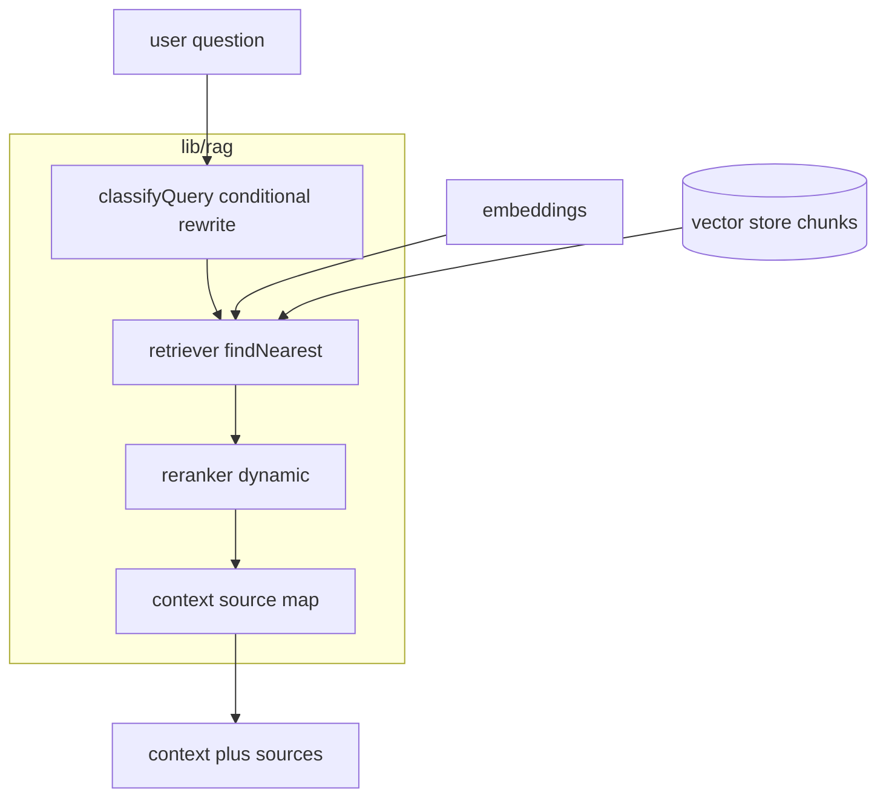

# RAG Retrieval & Rerank Pipeline

Use this skill to build the **retrieval half** of a RAG system: turn a user
question into ranked, relevant source chunks and a `sourceId → metadata` map the
generator needs for citations. It is deliberately provider-agnostic — embeddings
are injected, the vector store is one call, and a soft timeout ensures one slow
dependency never drags the tail.

## Locked decisions
- **The vector store is the same store used for session state** (e.g. Firestore
  `findNearest`, COSINE). Retrieval is **one** vector-search call — no SQL, no
  separate vector DB.
- **Embeddings are injected, not hard-coded.** `deps.embeddings.embed(text) ->
  number[]`; swap in the real client at wiring time.
- **Latency optimizations are required, not optional:** no blocking rewrite for
  clear queries, a single search call, a soft timeout, and a rerank that is
  *conditionally skipped* when top confidence is high.
- **Provider adapters stay injected** (the project DI pattern).

## Pipeline shape
A single `createPipeline(deps, options)` factory orchestrates the steps and
returns `buildContext(query)` — reranked docs plus a source map.

```ts
interface PipelineDeps { embeddings: Embedder; db: Db; }
interface Pipeline {
  run(query: string, opts?: PipelineOptions): Promise<RunOutcome>;
}
export function createPipeline(deps: PipelineDeps, options: PipelineOptions = {}): Pipeline { /* ... */ }
```

## Step data-flow


## The five steps
1. **Query classification (conditional rewrite).** A heuristic on pronouns + prior
   context decides whether a self-contained query passes straight through or gets
   rewritten when ambiguous. Self-contained queries do **not** block on a rewrite.
2. **Retrieval: a single vector-search call.** `retriever.retrieve(vector)` uses
   `findNearest` (COSINE), returns docs with a similarity score, and is Graceful on
   empty / below-threshold results.
3. **Soft timeout + concurrency limiting.** `withSoftTimeout` + `createSemaphore`
   wrap the search. Bounds how long we *wait*, returns what we have instead of
   hanging, and **never throws** on a rejection.
4. **Dynamic rerank (conditional skip).** Compare the top similarity score to a
   calibrated threshold and skip reranking above it, rerank below it.
5. **Context + source map.** `buildContext(hits)` → `context`, `sourceMap`,
   `sources`, capped to a `maxSources` window after a relevance floor.

## Test coverage (happy + non-happy)
- **classification** — self-contained passes through; ambiguous pronoun rewrites
  when context exists; no-context guard.
- **retrieval** — nearest-first ordering, id resolution, graceful empty.
- **limiter** — backpressure queues, bounded slow path, **soft fallback not
  throw**.
- **rerank** — skips above threshold, runs below.
- **context** — numbered sources, drops empty/low-relevance, capped window.
- **pipeline** — full flow integration; a timed-out retrieval surfaces gracefully.

## Non-obvious notes / gotchas
- **Similarity vs distance.** Firestore's `findNearest` returns *distance* under
  `distanceResultField`; compute `similarityScore = 1 - distance` so rerank/context
  thresholds read "higher = better" consistently.
- **Soft timeout does not cancel.** It bounds how long we *wait*; the underlying
  embed/query keeps running. That is deliberate — return what we have instead of
  killing work.
- **A rejected task must be swallowed like a timeout.** `withSoftTimeout` used to
  only handle timeouts; a **rejected** wrapped task (embed error, `findNearest`
  failure) propagated out of `pipeline.run()` and threw, and the generator
  silently answered without context. Treat a rejection like a timeout so retrieval
  never throws:
  ```ts
  .catch(() => ({ timedOut: true, value: fallback }))
  ```
- **A plain-array vector is not queryable from `findNearest`.** Chunks written
  with a raw array (instead of `FieldValue.vector`) produce an empty result. This
  is a classic cause of "no RAG intervention". (See the seed-corpus and terraform
  skills.)
- **A vector index is required.** `findNearest` throws `FAILED_PRECONDITION`
  until a vector index exists on the `embedding` field; the soft timeout swallows
  it into an empty result. (See the terraform skill.)
- **The threshold is a knob, not a truth.** `confidenceThreshold` must be
  calibrated on a labeled set; there is no universal value.
- **Context is capped.** Feed a bounded window (e.g. `maxSources` 5 after a
  `minScore` floor) to the LLM — greedy top-K introduces irrelevant sources.
- **Embed timeout must fit reality.** A 1500ms default embed soft timeout is too
  tight for a real embedding call; raise it (e.g. 8000ms embed, 4000ms retrieve).
- **No new runtime deps.** Embedding / rerank adapters are injected, so no SDK is
  added in this domain.

## Verification
```bash
npm test   # pipeline happy + non-happy tests pass with fakes
```
No cloud credentials required.