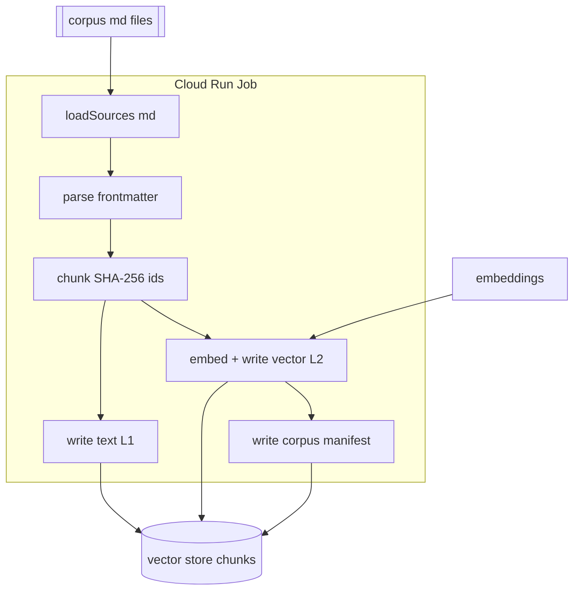
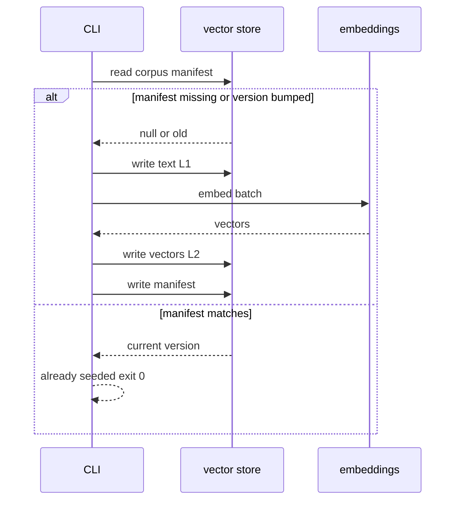

# Seed Corpus Job (one-time, idempotent)

Use this skill to build a **corpus → vector store** seeder: a one-time (and
re-runnable) job that populates a `chunks` collection with source content — first
raw text, then an added vector field so retrieval can search it — and finally a
`corpus/manifest` marker that makes every subsequent run a fast no-op.

## Locked decisions
- **Deterministic doc ids = SHA-256 of chunk text**; writes stay idempotent. A
  re-run produces the same ids, so upserts are true no-ops.
- **Two-phase write:** Location 1 (text/metadata) persists *before* Location 2
  (vectors), so text is writable even if embedding later fails; a re-run only
  fills missing vectors.
- **Batched array embedding calls** — one `embeddings.embed(texts[])` per batch.
- **Manifest gate** — a `corpus/manifest` records `version`; a run with a matching
  version exits "already seeded" and writes nothing.
- **Deploy as a one-time Cloud Run Job** (≤24h timeout) that runs a CLI entry.
- **Batches ≤ 32 chunks** with one Firestore `batch()` per batch (≤500 ops).

## Files to create
| File | Contents |
| --- | --- |
| `lib/frontmatter.ts` | `parseSource` — minimal `key: value` front-matter → `{id, category, title, url, body}` (no YAML dep) |
| `lib/chunker.ts` | `chunkText` (size ~800, overlap ~120) + `hashText` (SHA-256 ids) |
| `lib/manifest.ts` | `readManifest` / `checkSeedNeeded(manifest, version)` / `writeManifest` |
| `lib/seeder.ts` | `writeTextFields` (batch) + `writeVectors` (embed + vector write, retry/backoff) |
| `lib/orchestrate.ts` | `runSeed` wiring steps + `CURRENT_VERSION` |
| `lib/loadSources.ts` | `loadSources(dir)` recursive reader of `*.md` |
| `src/cli.ts` | job entrypoint; reads `CORPUS_DIR`, seeds, exits non-zero on failure |

## Data-flow


### Idempotency gate (second run is a no-op)


## Test coverage (happy + non-happy)
- **frontmatter** — happy parse; missing-required-key skip; non-frontmatter skip.
- **chunker** — happy chunk + valid 64-hex hash; stable id for identical text.
- **manifest** — already-seeded short-circuit; version bump re-seed; missing
  manifest seeds.
- **seeder/orchestrate** — text + vector round-trip; embedding 429 backoff then
  continue; end-to-end idempotency (2nd run skips).
- **finalize** — final chunkCount/dims/model written; fatal failure throws
  (non-zero).

## Non-obvious notes / gotchas
- **Vectors MUST be `FieldValue.vector(...)` (root cause of "no RAG").** Real
  Firestore only treats a field as a *vector* for `findNearest` when it is
  written with `FieldValue.vector(array)`. Writing a plain array makes retrieval
  return nothing. The in-memory fake stores a plain array, so **unit tests pass
  even when the real write is wrong** — verify against a real store after deploy.
- **Re-seeding requires a version bump.** Once chunks are seeded (or a broken
  `chunkCount: 0` manifest was written), the gate only compares the version
  string. To force a real re-seed, **bump `CURRENT_VERSION`**, rebuild/push, then
  execute the job. A `chunkCount: 0` usually means a stale image with no corpus —
  the corpus must be baked into the image the job references.
- **Location 1 before Location 2.** Text/metadata are writable even if embedding
  later fails; a re-run only fills missing vectors.
- **Embedding retries.** 429/5xx retried with exponential backoff
  (`retryBaseMs * 2**attempt`); non-retryable (`INVALID_ARGUMENT`,
  `UNAUTHENTICATED`, `FORBIDDEN`) abort the batch.
- **No front-matter YAML dependency** — a minimal `key: value` parser keeps deps
  out.
- **`.dockerignore` must NOT exclude the corpus `*.md`** if the image is to bake
  the corpus.

## Verification
```bash
npm test   # 13+ happy + non-happy tests pass
npm start  # local run against a real store + CORPUS_DIR (real embedder wired in)
```
No credentials for the test suite.