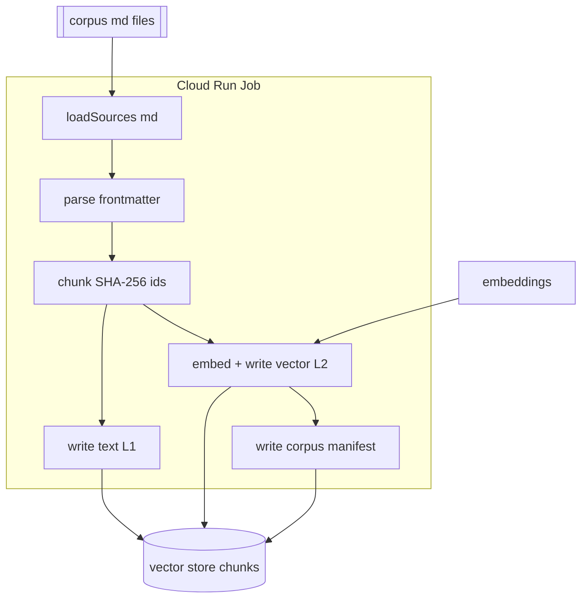
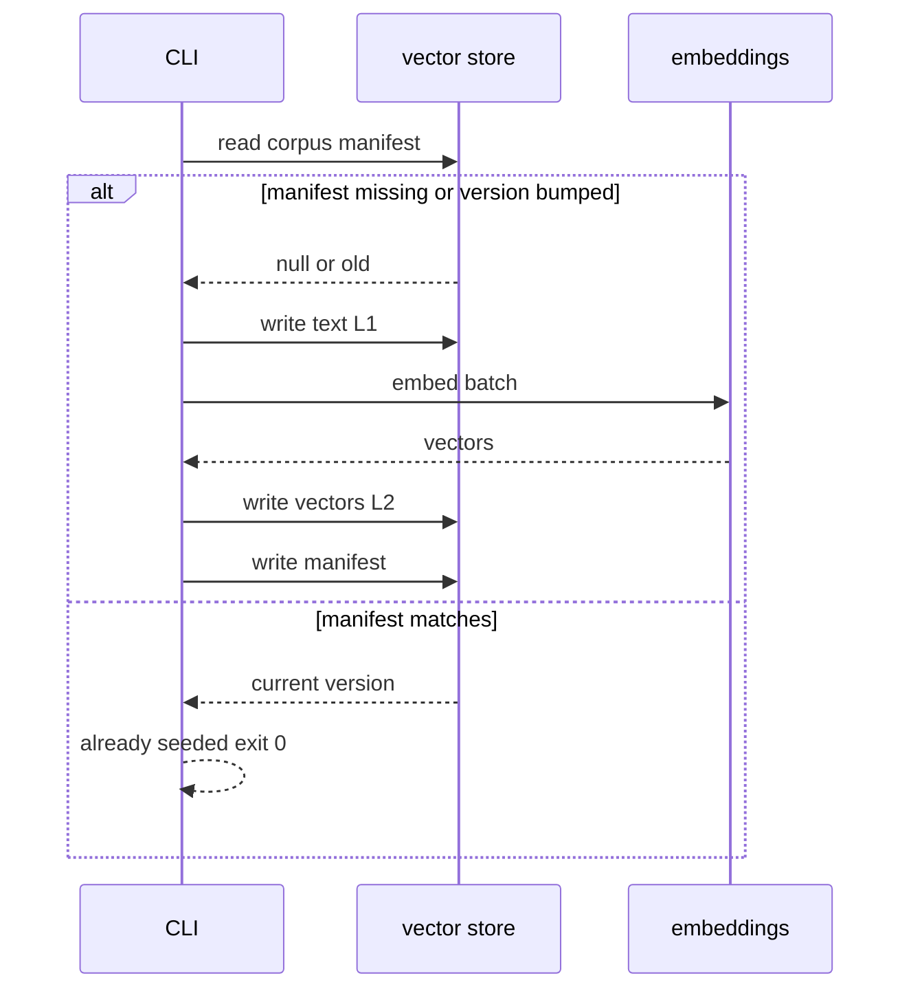

# Seed Corpus Job (one-time, idempotent)

Use this skill to build a **corpus → vector store** seeder: a one-time (and
re-runnable) job that populates a `chunks` collection with source content — first
raw text, then an added vector field so retrieval can search it — and finally a
`corpus/manifest` marker that makes every subsequent run a fast no-op.

## Locked decisions
- **Deterministic doc ids = SHA-256 of chunk text**; writes stay idempotent. A
  re-run produces the same ids, so upserts are true no-ops.
- **Two-phase write:** Location 1 (text/metadata) persists *before* Location 2
  (vectors), so text is writable even if embedding later fails; a re-run only
  fills missing vectors.
- **Batched array embedding calls** — one `embeddings.embed(texts[])` per batch.
- **Manifest gate** — a `corpus/manifest` records `version`; a run with a matching
  version exits "already seeded" and writes nothing.
- **Deploy as a one-time Cloud Run Job** (≤24h timeout) that runs a CLI entry.
- **Batches ≤ 32 chunks** with one Firestore `batch()` per batch (≤500 ops).

## Files to create
| File | Contents |
| --- | --- |
| `lib/frontmatter.ts` | `parseSource` — minimal `key: value` front-matter → `{id, category, title, url, tags?, body}` (no YAML dep; `tags` optional, comma-split) |
| `lib/chunker.ts` | `chunkText` (size ~800, overlap ~120) + `hashText` (SHA-256 ids) |
| `lib/manifest.ts` | `readManifest` / `checkSeedNeeded(manifest, version)` / `writeManifest` |
| `lib/seeder.ts` | `writeTextFields` (batch, stores `tags`) + `writeVectors` (embed + vector write, retry/backoff) |
| `lib/orchestrate.ts` | `runSeed` wiring steps + `CURRENT_VERSION` |
| `lib/loadSources.ts` | `loadSources(dir)` recursive reader of `*.md` |
| `src/cli.ts` | job entrypoint; reads `CORPUS_DIR`, seeds, exits non-zero on failure |

## Corpus authoring — real variation, not clones

Adding more content does **not** mean adding near-copies of existing files. A
corpus of look-alike chunks makes retrieval/de-dup harder and adds embed cost with
no retrieval-quality benefit. Every added file must carry **genuinely distinct
content**.

- **Do NOT make `-2` clones.** A `backpack-2.md` that re-writes the same product
  (same name, same specs, same setup) dillutes the vector space. If a topic is
  already covered, extend the *original* file instead of creating a sibling.
- **Merge, don't duplicate.** Reachable sub-topics (e.g. an extra FAQs section)
  belong inside the original file that owns the topic (`care.md`), not a
  `care-2.md`.
- **New content = new identity.** When adding a file, give it a real variation:
  a **new product** (distinct name + specs + setup + care + warranty), a **new
  topic**, or a **new category** in the same domain. For a camping/outdoor corpus
  that means genuinely different items (knife, headlamp, power station, filter,
  table, poles) rather than paraphrase-of-the-original.
- **Never duplicate or contradict an existing file.** Check the corpus first. A
  second file claiming "cadeaukaarten vervallen na 24 maanden" directly
  contradicts the existing "cadeaukaarten vervallen niet" — retrieval would
  return conflicting sources and the demo answer would be inconsistent. When in
  doubt, re-read the owning file before adding.
- **Verify after adding.** Every new file must parse front-matter cleanly (0
  skipped) and increase the chunk count meaningfully. Run `loadSources` + `parseSource`
  + `chunkText` over the corpus and confirm no skips.

### Example — the anti-pattern vs. the fix
| Anti-pattern (clones / duplicates) | Fix (real variation) |
| --- | --- |
| `products/backpack-2.md` re-describing the Trailback 40 | a new, distinct product file (e.g. a knife, headlamp, water filter, power station) |
| `faq/care-2.md` repeating `care.md` topics | append the genuinely-new sub-topic to `care.md` |
| `policies/giftcard-policy.md` saying "24 maanden" when `giftcards.md` says "vervalt niet" | check the owning file first; do not add a conflicting policy |
| `loyalty/redeem.md` duplicating `rewards.md` | extend `rewards.md`, or add a truly new loyalty topic (membership levels, referrals) |

Any corpus content change still requires a **`CURRENT_VERSION` bump** so the
manifest gate re-seeds (see gotchas).

## Option B — `tags` (synonyms embedded into every chunk)

When retrieval misses queries that use **synonyms / generic words** (e.g. "eten",
"hoofdlamp") while the corpus says "kooktoestel", "koplamp", the fix is Option B: a
`tags:` front-matter list on the source, **stored on the chunk doc** and
**prepended to the embedded text of EVERY chunk** so the synonym signal reaches
every vector, not just the first chunk.

- **Front-matter:** `tags: hoofdlamp, koplamp, lamp, verlichting` in the source
  header. It is **optional** (never blocks a file — only `id/category/title/url`
  are required). Parse with a tiny comma-split + trim + dedupe (`parseTags`), no
  YAML dep.
- **Stored on the chunk doc:** `writeTextFields` writes `tags` so the Firestore
  chunk has a structured, queryable field (`tags: string[]` on `ParsedSource` and
  `Chunk`).
- **Embed into every chunk — NOT the body.** Add an `embedTextForChunk(chunk)`
  helper that returns `"<tags>. <body text>"`, and have `writeVectors` embed that
  instead of raw `chunk.text`. Because it runs on every chunk of a source, the
  synonym terms reach all of that source's vectors — **not just the first chunk**
  (the flaw of Option A, where an inline line sits only in chunk 0).
- **Keep the stored `text` pure.** The Firestore `text` field stays the original
  body (no tag prefix), so citations/answers and the source map remain tied to the
  original chunk — tags only influence the embedded vector, never displayed content.
- **This is complementary to query-side expansion (Option C):** B enriches the
  index; C enriches the query. B alone fixes queries that use known aliases against
  the tagged chunks.

```ts
// lib/seeder.ts
export function embedTextForChunk(chunk: Chunk): string {
  const tags = chunk.tags?.length ? chunk.tags.join(', ') : '';
  return tags ? `${tags}. ${chunk.text}` : chunk.text;
}
// writeVectors embeds chunks.map(embedTextForChunk), not chunks.map(c => c.text)
```

- **Tests (happy + non-happy):** tags parse & de-dupe; tags absent → `[]`; the
  embed input is tag-prefixed; the stored `text` is NOT tag-prefixed; tags are
  stored on the doc. Assert `embedTextForChunk` directly (pure function) and check
  the fake Firestore doc for both `text` (pure) and `tags` (array).

## Data-flow


### Idempotency gate (second run is a no-op)


## Test coverage (happy + non-happy)
- **frontmatter** — happy parse; missing-required-key skip; non-frontmatter skip.
- **chunker** — happy chunk + valid 64-hex hash; stable id for identical text.
- **manifest** — already-seeded short-circuit; version bump re-seed; missing
  manifest seeds.
- **seeder/orchestrate** — text + vector round-trip; embedding 429 backoff then
  continue; end-to-end idempotency (2nd run skips).
- **finalize** — final chunkCount/dims/model written; fatal failure throws
  (non-zero).

## Non-obvious notes / gotchas
- **Vectors MUST be `FieldValue.vector(...)` (root cause of "no RAG").** Real
  Firestore only treats a field as a *vector* for `findNearest` when it is
  written with `FieldValue.vector(array)`. Writing a plain array makes retrieval
  return nothing. The in-memory fake stores a plain array, so **unit tests pass
  even when the real write is wrong** — verify against a real store after deploy.
- **Re-seeding requires a version bump.** Once chunks are seeded (or a broken
  `chunkCount: 0` manifest was written), the gate only compares the version
  string. To force a real re-seed, **bump `CURRENT_VERSION`**, rebuild/push, then
  execute the job. This applies to **any** corpus content change — adding or
  editing a single `*.md` file means the old version string still matches, so the
  job would exit "already seeded" and the new content would never reach Firestore.
  A `chunkCount: 0` usually means a stale image with no corpus — the corpus must
  be baked into the image the job references.
- **Location 1 before Location 2.** Text/metadata are writable even if embedding
  later fails; a re-run only fills missing vectors.
- **Embedding retries.** 429/5xx retried with exponential backoff
  (`retryBaseMs * 2**attempt`); non-retryable (`INVALID_ARGUMENT`,
  `UNAUTHENTICATED`, `FORBIDDEN`) abort the batch.
- **No front-matter YAML dependency** — a minimal `key: value` parser keeps deps
  out.
- **`.dockerignore` must NOT exclude the corpus `*.md`** if the image is to bake
  the corpus.

## Verification
```bash
npm test   # 13+ happy + non-happy tests pass
npm start  # local run against a real store + CORPUS_DIR (real embedder wired in)
```
No credentials for the test suite.