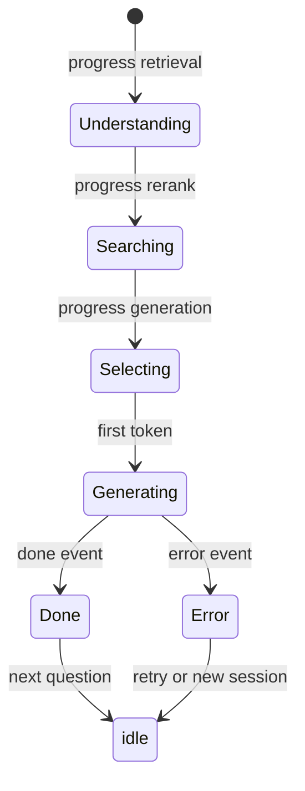

# SSE Production Hardening + Live UX Polish

Use this skill to harden a streaming SSE chat for production and fix the
live-observed UX gaps that make a stream feel broken even when the bytes flow.
It covers the classic SSE pitfalls plus the frontend stage-machine and
observability issues that surface in real use.

## The classic SSE pitfalls (and their fixes)
1. **Proxy buffering** — a reverse proxy can buffer the stream so tokens arrive in
   bursts or never. Fix: write `X-Accel-Buffering: no` on the SSE response and
   ensure the edge passes SSE through.
2. **Cross-instance state** — if the backend scales to N instances, a reconnect
   landing on a different instance must still resume. Fix: state lives in a shared
   store (see the stateless-session-state skill), so a reconnect by `sessionId`
   resumes correctly.
3. **Content safety** — a policy engine is often out of scope for a demo; keep it
   explicit as deferred.
4. **Observability** — surface per-stage timing (embed, retrieval, rerank,
   **generation**, e2e) so the bottleneck is visible. (A BigQuery sink is often
   excluded by locked decisions — keep it out unless approved.)

## The live-observed UX gaps (the real "hardening")

### A — stuck on a stage while text streams in
**Symptom:** the progress label shows `Selecting` (the label for the `generation`
stage) even though tokens are visibly arriving.

**Root cause:** the backend emits `progress { stage: generation, progress: 80 }`
*before* the first token, and the frontend maps `generation` → `Selecting` and
never changes the stage again.

**Fix (frontend):** a **client-side stage machine** that advances on *events*, not
just the backend's coarse progress frames:
- `retrieval` → `Understanding`
- `rerank` → `Searching`
- `generation` (progress event) → `Selecting`
- **first `token` event** → `Generating` (new)
- **`done`** → `Done` (new, brief)

### Problem B — no `Generating` state
Extend the `ProgressStage` union with `generating` (and optionally `done`), add
`STAGE_LABELS.generating = 'Generating'`, and in `appendToken` advance the stage
to `generating` when the first token arrives while still on `generation`.

### Problem C — no spinners / "busy" affordances
Add an animated **three-dot** pulse next to the stage label (pure CSS keyframes,
utility classes + a tiny scoped style) and make the progress bar
**indeterminate/breathing** during `generating` so it reads as "alive".

### Problem D — no generating timing in the debug view
The RAG trace shows only retrieval-side timings; the **generation** phase (the LLM
stream — usually the dominant cost) is missing.

**Fix (backend + frontend):** add a `generation` field to the timings type,
measured in the generator from just before the stream opens until it completes (or
errors), and emit it in the trace payload. Compute `e2e = total + generation`.

### Problem E — timings as a flat text line
Render per-stage timings as **horizontal bars, stacked below each other** — one row
per stage (`Embed`, `Retrieve`, `Rerank`, `Generate`, `E2E`), each with a label, a
bar whose width is proportional to that stage's ms (relative to the largest), and
the ms value. Add a pure helper `timingBars(timings) → { label, ms, pct }[]` that
is unit-testable.

## Stage machine (client-side, token-driven)

## Backend additions (small, backward-compatible)
- **`generating` progress signal** — reuse the existing `progress` event with a new
  `stage: 'generating'` just before the first token. Do **not** add a new SSE event
  type (that would touch the parser, the store switch, and the type unions for no
  benefit).
- **`generation` timing** — record `Date.now()` just before the generation loop and
  after it (or after the error path), pass it into the trace builder, and merge it
  into the same `timings` object. `total` stays the retrieval-pipeline total; the
  new `generation` is measured in the generator.

## Test coverage (happy + non-happy)
- **Frontend stage machine** — happy: advances to `generating` on first token;
  label mapping. Non-happy: a replayed `retrieval` progress after tokens started
  does **not** regress the stage.
- **Frontend timing bars** — happy: `timingBars` returns one row per stage with
  `ms` and a `pct` proportional to the largest; non-happy: a missing/zero
  `generation` is handled gracefully (no NaN, no crash).
- **Backend** — happy: the stream emits a `generating` progress event before the
  first token; the trace `timings.generation` is populated and ≥ 0. Non-happy: if
  the stream errors before any token, no `generating` event is emitted.

## Non-obvious notes / gotchas
- **Reuse `progress`, don't add an event type.** `progress` already carries
  `stage`; a new event type would ripple through parser, store switch, and type
  unions for no benefit.
- **`total` vs `generation` vs `e2e`.** `total` = retrieval pipeline up to context
  build; `generation` = the LLM stream; `e2e = total + generation`. Keep them
  distinct so the bottleneck is visible.
- **The stage must never regress.** A replayed progress event after tokens flow
  must not move the stage backward — the "idempotent UI" rule.
- **No new runtime deps.** Spinners are pure CSS animation; timing bars are pure
  functions. No spinner library, no chart library.

## Definition of done
- Frontend: `typecheck` → `lint` → `test` → `build` all pass.
- Backend: `typecheck` → `lint` → `test` → `build` all pass.
- Live: the indicator shows `Understanding → Searching → Selecting → Generating`
  with animated dots while tokens stream; the stage never regresses on a replay;
  the observability view shows stacked timing bars for `Embed / Retrieve / Rerank /
  Generate / E2E`.
- No new runtime dependencies; no `any`; utility-first styling.