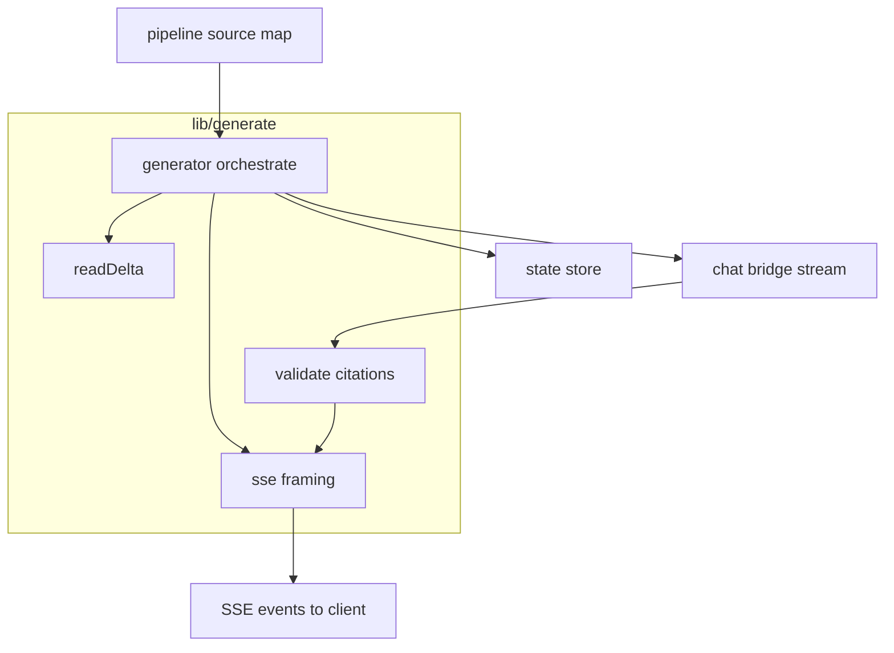
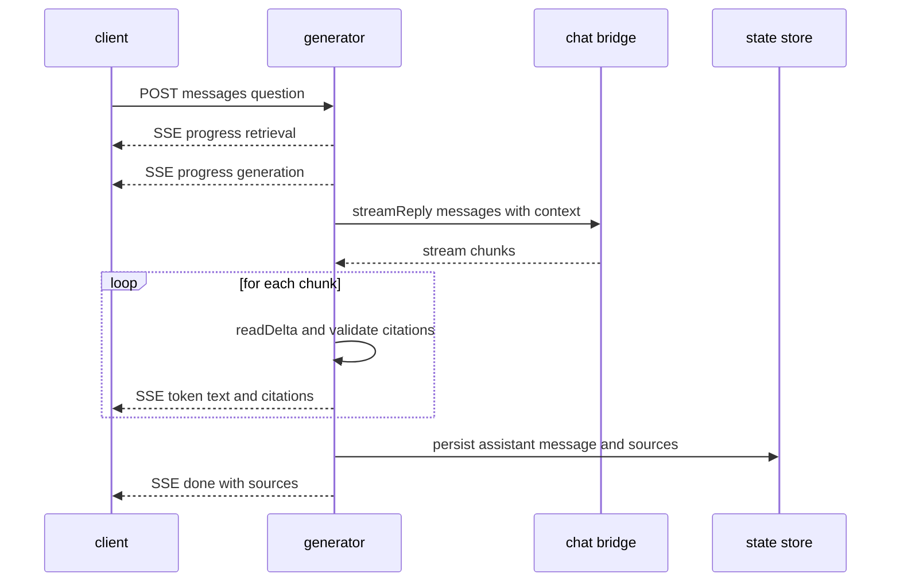
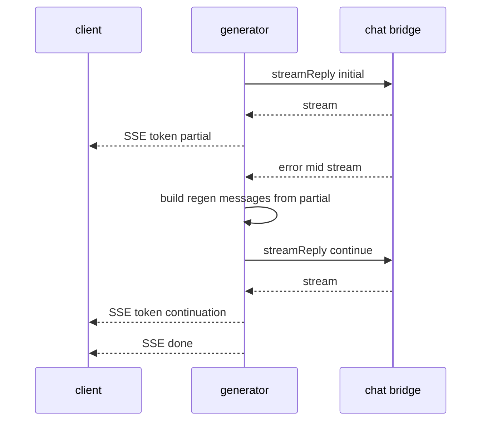

# SSE Streaming Generation + Source Attribution

Use this skill to build the **generation half** of a RAG chat: an SSE route that
gets a `res`-shaped sink and a generator pumps `progress → tokens → done` (or
`error`) into it as typed SSE frames. Every token delta from the model is
validated against the source map retrieval built, so the LLM cannot inject a
hallucinated citation. If the stream dies mid-answer the generator *regenerates
from context* — never re-splicing, never returning HTTP 500 after the response
already started.

## Locked decisions
- **Provider is injectable.** The chat SDK is *not* a hard dependency; a bridge
  accepts any object exposing a `chat.send({ model, messages, stream: true })`
  async-iterable. The real SDK plugs in at wiring time.
- **Source attribution is validated; LLM metadata is untrusted.** Strip/normalize
  inline `[Source N]` markers against the source map built during retrieval.
- **Typed SSE frames with a monotonic `id`.** `id`, `event`, `data` frames plus
  `X-Accel-Buffering: no` so a proxy does not buffer the stream.
- **Mid-stream failure → SSE `error` (200) + context-assisted regeneration**, never
  an HTTP 500 after the response started.
- **Persist the completed message** to the state store on `done`.

## Data-flow


### Streaming happy path (with validated inline citation)


### Mid-stream failure recovery (context-assisted regeneration)


## The steps
1. **SSE endpoint** — `createSse(res)` writes `200 text/event-stream`, monotonic
   `id: N`, typed `event`/`data`. All writes go through it.
2. **Provider streaming call** — `createChatBridge` → `for await` over the
   stream; `readDelta` extracts `delta.content`; `normalizeError` reads
   `statusCode`. `readDelta` returns `''` for frames with no token so the loop
   skips them gracefully.
3. **Inline citation validation** — `validateCitations` against the source map:
   keep valid canonicalized, normalize case/space, strip invalid `[Source N]`;
   `listSources` for clickable chips.
4. **Mid-stream failure → context-assisted regen** — append the already-generated
   assistant text + a "Continue…" user message so the model resumes consistently
   without duplicating. Retries capped (`maxRegenRetries`, default 2).

## Test coverage (happy + non-happy)
- **SSE** — typed ids + headers; progress→token order; error event (200, not 500)
  after start.
- **bridge** — forwards each delta; empty-delta tolerance; `normalizeError` 429/5xx
  retryable; throws normalized on mid-stream.
- **citations** — valid citation kept + case/space normalized; strip non-existent
  `[Source 9]`; ordered chip list.
- **regen** — regeneration after interruption recovers; caps retries then `error`
  (never infinite).

## Non-obvious notes / gotchas
- **The provider SDK is injected, not imported.** `createChatBridge` accepts any
  object whose `chat.send(params)` returns an async-iterable of chunks structured
  like `{ choices: [{ delta: { content } }] }`; errors expose `statusCode`. Tests
  inject fake async generators, so null I/O.
- **`readDelta` is the seam.** Models can return deltas under different shapes or
  reasoning-text frames with empty `content`. Return `''` for no-token frames so
  the loop skips them.
- **Citation rule is "untrusted".** Retrieval puts numbered `[Source N]`
  lines into the *context*; `validateCitations` does the opposite — *strips*
  invalid inline citations the model wrote into its answer and canonicalizes the
  `[Source N]` text sent to the client.
- **Regeneration is continuation, not re-splice.** Append the partial assistant
  text + a "Continue…" user message, so the model resumes without duplicating.
- **Failure path is an `error` event, not a 500.** Once the response started, the
  only correct failure mode is an SSE `error` frame with the normalized
  `{message, statusCode}`.
- **`sse.end()` / `sse.error()` must actually end the response.** Guarded,
  idempotent `res.end()`; otherwise the client's stream reader never gets its done
  signal and `for await` stalls forever.
- **Silent no-context fallback must be visible.** If retrieval falls back to
  empty context, keep the `query` and record `error: {message}` + `timedOut: true`
  so the UI can show "Retrieval failed — answering without context." instead of a
  silent answer.

## Verification
```bash
npm test   # SSE + bridge + citations + regen happy/non-happy tests pass with fakes
```
No cloud credentials required.