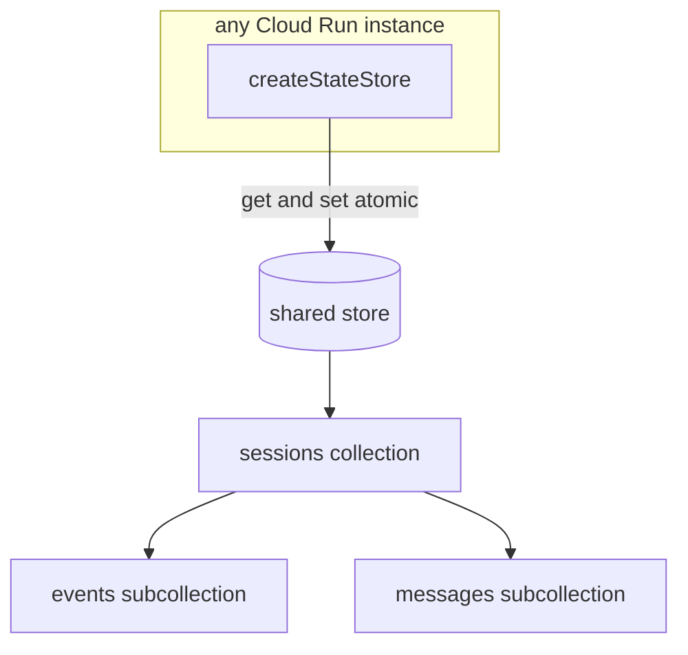
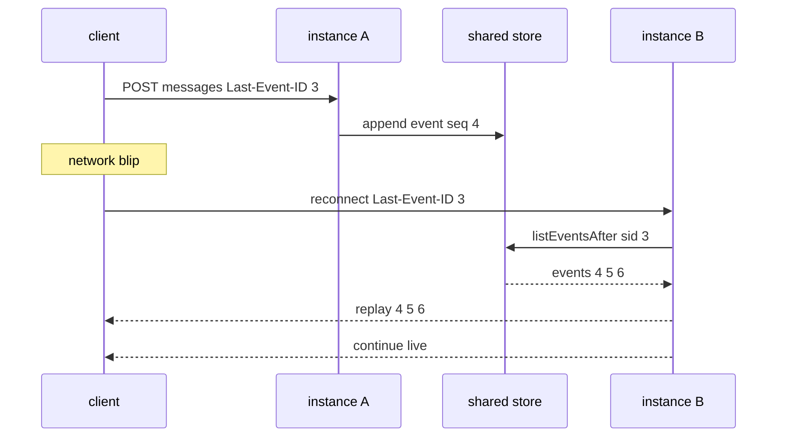

# Stateless Session & Event State (shared store)

Use this skill to design the **state layer** of a horizontally-scaled backend so
that a request can land on **any** instance and still resume a session by id with
its exact stream position. This is the structural fix for "instances hopping" —
when a service scales to N instances and each keeps its own in-memory session, a
request that hops instances loses all context. The answer is a **shared,
stateless** store (e.g. Cloud Firestore) that every instance reads and writes.

## Locked decisions
- **State lives in a shared store, never in instance memory.** No in-memory
  session cache. Every instance binds the same store via a factory.
- **Deterministic, monotonic event ids** so a reconnecting client resumes without
  duplicating or rewinding.
- **Atomic appends** — reading the session, validating status, allocating the
  next id, writing the event, and bumping the cursor all happen in one
  transaction.
- **TTL / cleanup** via an `expiresAt` field paired with a store-level TTL policy,
  plus an `active | closed` status guard on writes.
- **Tests need zero cloud credentials** — inject an in-memory store-shaped fake
  and a fake clock.

## The store shape
A single factory returns the state API. Dependencies are injected; the real cloud
client is the only place a cast to the store interface should live (in the server
entrypoint).

```ts
interface StateStoreDeps { db: Db; clock?: () => number; }
interface StateStore {
  getSession(sessionId): Promise<Session | null>;
  createSession(sessionId, userId): Promise<Session>;
  appendEvents(sessionId, events): Promise<Event[]>;
  listEventsAfter(sessionId, afterSeq): Promise<Event[]>;
  persistMessage(sessionId, message): Promise<void>;
  closeSession(sessionId): Promise<void>;
}
export function createStateStore(deps: StateStoreDeps, options: StateStoreOptions = {}): StateStore { /* ... */ }
```

## Data-flow map


### Reconnection resume across a different instance


## Key design rules
- **Event id = zero-padded monotonic `seq`** (`000001`, `000002`, …). The client
  sends `Last-Event-ID` (= last seq it saw); the backend calls
  `listEventsAfter(sessionId, lastSeq)` and replays strictly after it. Zero
  duplicates, zero rewind.
- **Atomic append = transaction.** `appendEvents` reads the session, validates
  status, allocates `seq`, writes the event sub-doc, and bumps `eventSeq` /
  `lastEventId` all inside one transaction. A closed session aborts the whole
  batch.
- **`expiresAt: null` deletes the field** in real Firestore → clears the TTL
  trigger. `closeSession` uses it so a *closed* session is kept; only *idle*
  sessions auto-expire.
- **Tests inject a `clock`.** `createStateStore(db, { clock, sessionTtlSeconds })`
  keeps tests hermetically deterministic — no real timers, no `sleep`.
- **Deterministic message ids** when supplied; otherwise clock-based. (Chunk ids
  in a seed job are content-hash based — see the seed-corpus skill.)

## Test coverage (happy + non-happy)
Cover both paths for every step:
- **Happy:** persists a session with `lastEventId`; idempotent re-create returns
  unchanged; extends an active session TTL and advances `lastEventId`; assigns
  monotonic seq ids and bumps `eventSeq` atomically; appends many events in one
  transaction; replays strictly after `lastEventId`; dedupes an already-sent id;
  replays everything from the start; marks a session closed after idle TTL;
  persists/reads a message with sources and complete flag; lists messages oldest
  first.
- **Non-happy:** rejects writing an event for a closed session; throws
  `SessionNotFoundError` when closing/appending to an unknown session; does not
  extend a closed session; throws `InvalidEventError` for an unsupported type and
  writes nothing.

## Non-obvious notes
- **No `batch()` in the session fake.** `batch()` is for bulk seed writes (many
  docs), not per-stream transactional writes. The fake only implements what the
  store calls.
- **The fake stores a plain array for vectors** — real Firestore requires
  `FieldValue.vector(...)` for `findNearest`. The fake will NOT catch a
  real-write regression, so verify with a real query after deploy.
- **A closed session is kept, an idle one expires.** The TTL field is cleared on
  close so closed sessions survive; only idle sessions are auto-removed.

## Verification
```bash
npm test   # happy + non-happy store tests pass with the in-memory fake
```
No cloud credentials required.