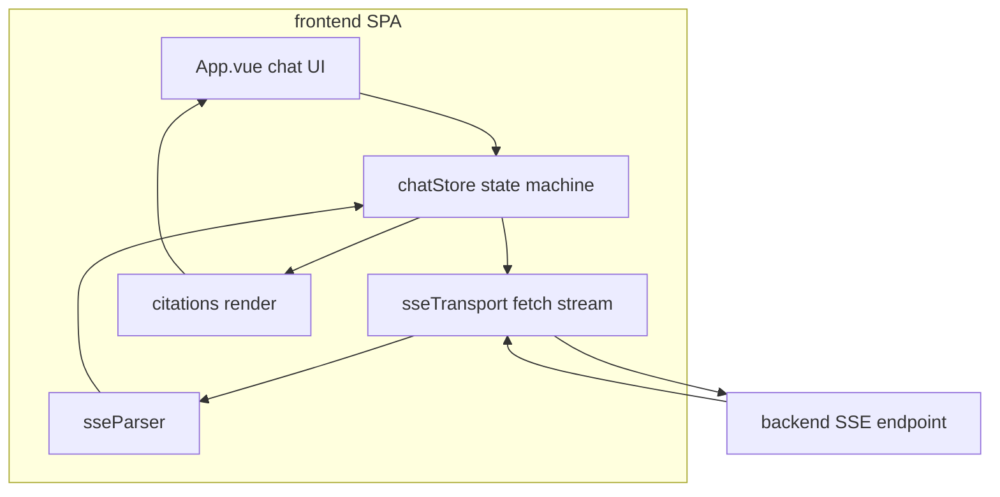
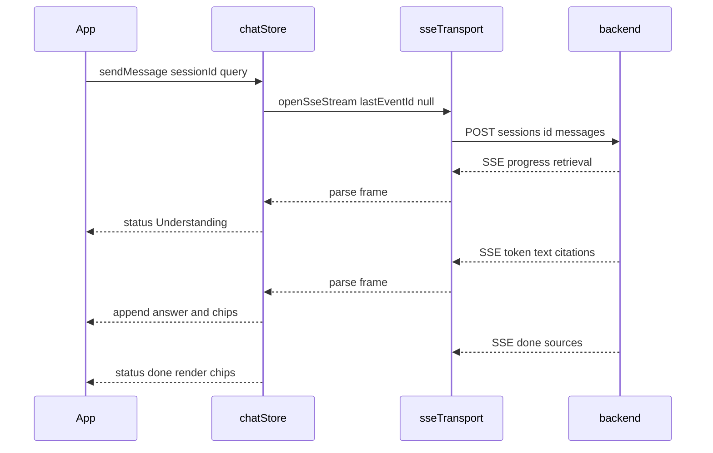
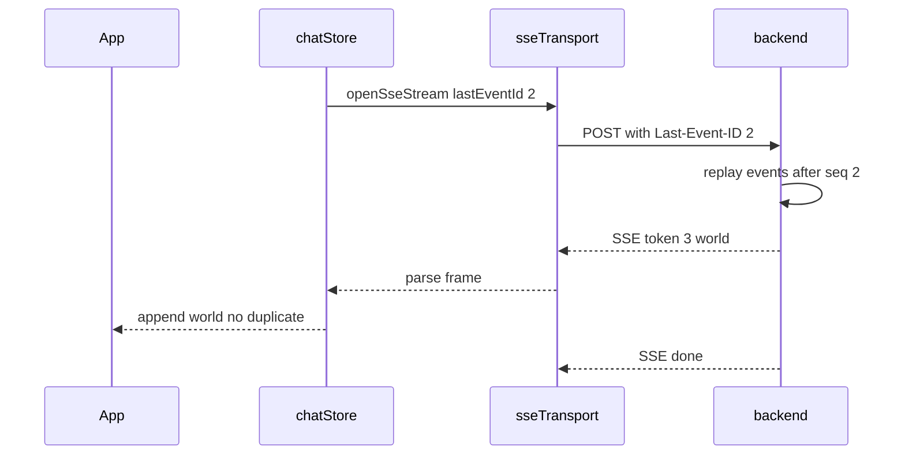

# Streaming Chat Frontend (Vue 3)

Use this skill to build the **browser half** of an SSE streaming chat. It owns
the SSE consumer, the progress state machine, reconnection with `Last-Event-ID`,
and clickable source citations. The backend endpoint is a **POST**, so the native
`EventSource` API cannot be used (it only supports GET); the frontend opens the
stream with `fetch` + a `ReadableStream` body reader instead.

## Locked decisions
- **Reactive state store** via a `createChatStore({ send })` factory that takes an
  injected transport — the store is the seam, so tests run with fake async
  generators (no network, no DOM).
- **SSE via `fetch` + `res.body.getReader()` + `TextDecoder`** (POST body), not
  `EventSource`.
- **Client-side stage machine** that advances on events: `retrieval →
  Understanding`, `rerank → Searching`, `generation → Selecting`, **first
  `token` → Generating**, `done → Done`, `error → Error`.
- **Reconnection is store-driven** — the store remembers `lastEventId` and sends it
  back on the next stream as the `Last-Event-ID` header.
- **Citations are backend-validated**, so rendering the answer as HTML is safe.
- **Styling is utility-first** (e.g. Tailwind); scoped CSS only if truly needed.

## Data-flow


### Streaming happy path


### Reconnection with Last-Event-ID


## The steps
1. **SSE consumer** — `sseTransport` (`fetch` + `ReadableStream`, POST body) yields
   raw SSE text chunks; `sseParser` turns them into typed frames (handling partial
   buffers, comments, non-JSON data); the store appends tokens live. **The component
   must then render the live `state.answer` while streaming** (not only the
   finalized message on `done`) — see the gotcha below.
2. **Progress UI states** — `STAGES`/`STAGE_LABELS` map backend stages to labels;
   `applyProgress` never regresses (a replayed progress event cannot jump the bar
   backward).
3. **Reconnection with `Last-Event-ID`** — the store remembers `lastEventId`, sends
   it back, exponential backoff, capped retries → manual retry.
4. **Citation rendering + static hosting** — `renderAnswer` (inline chips, HTML
   escaped) + `buildSourceChips` (clickable, safe fallback); serve the built `dist/`
   via a static server.

## Test coverage (happy + non-happy)
- **parser** — typed frame parse; multi-frame + partial buffer; non-JSON data;
  comment/keep-alive; default event.
- **store** — tokens render live; **state is reactive** (a plain object silently
  breaks rendering — assert `isReactive`); running citation merge; error event →
  retry banner with partial output preserved.
- **stage machine** — advances per stage; **no backward jump** on a replayed
  progress event; advances to `Generating` on first token.
- **reconnection** — resumes without duplicates; sends `lastEventId` back; backoff
  then manual retry; manual retry after a terminal error succeeds.
- **citations** — inline `[Source N]` → chip span; HTML escaped (no injection);
  safe fallback for missing url; drops title-less sources.

## Non-obvious notes / gotchas
- **Reactivity is required for rendering.** `createChatStore` must wrap `state` in
  Vue's `reactive()`, so `computed`/template bindings re-render on every SSE
  mutation. A **plain object** silently breaks the UI — frames arrive (network tab
  looks fine) but nothing renders. Assert `isReactive(store.state)`.
- **Render `state.answer` live DURING streaming, not only on `done`.** The store
  grows `state.answer` token-by-token in every `token` frame, but the transcript
  (`state.messages`) only receives the finalized assistant message on `done`. If
  the component renders *only* `state.messages`, the text appears to arrive **all
  at once** when `done` fires — masking the SSE streaming even though the backend
  streams perfectly. Fix: render a **live assistant bubble** from `state.answer`
  while `status === streaming`, then let the completed message (with source chips)
  replace it on `done`. Guard the live bubble with `isStreaming` so it never
  duplicates the finalized message. The store's grew-live behavior is already
  asserted (`expect(state.answer).toBe('Hello ')` mid-stream), so catch this at the
  *component* render layer, not the store.
- **`EventSource` cannot be used.** The endpoint is a POST (a body is required);
  use `fetch` + `res.body.getReader()` + `TextDecoder`, yielding raw SSE text
  chunks to the parser. This mirrors the backend's own stream reader.
- **The store is the seam, not the component.** `createChatStore({ send })` takes
  an injected transport, so store tests run with fake async generators. The app
  wires the real transport.
- **Progress never regresses.** `applyProgress` only raises `progress`; a replayed
  event cannot make the bar jump backward — the "idempotent UI" rule.
- **Reconnection is store-driven, not transport-driven.** The store remembers
  `lastEventId` and passes it back; the backend replays from that seq, so a
  reconnect landing on a *different* instance resumes correctly.
- **`crypto.randomUUID()`** generates the client-side `sessionId` (browser global;
  Node 20+ also has it). A "New session" resets the store and rolls a fresh id.
- **Separate origin → CORS.** If the UI and backend are separate services, the
  backend must answer the `OPTIONS` preflight (204) and add `Access-Control-*`
  headers to the SSE frames. Do not reverse-proxy in nginx.
- **Runtime backend origin.** Resolve the backend base URL from a runtime-injected
  value (`window.__API_BASE__`) → a build-time env → same-origin (local dev via the
  dev-server proxy). If the UI POSTs to its *own* origin and gets `HTTP 405`, the
  backend URL was not configured — a static server rejected the POST. Bake the URL
  as a build arg for container deploys.

## Verification
```bash
npm test        # parser + store + citations + config tests pass
npm run build   # static build emits dist (Vite/TS errors caught)
```
No network or DOM required for the tests.